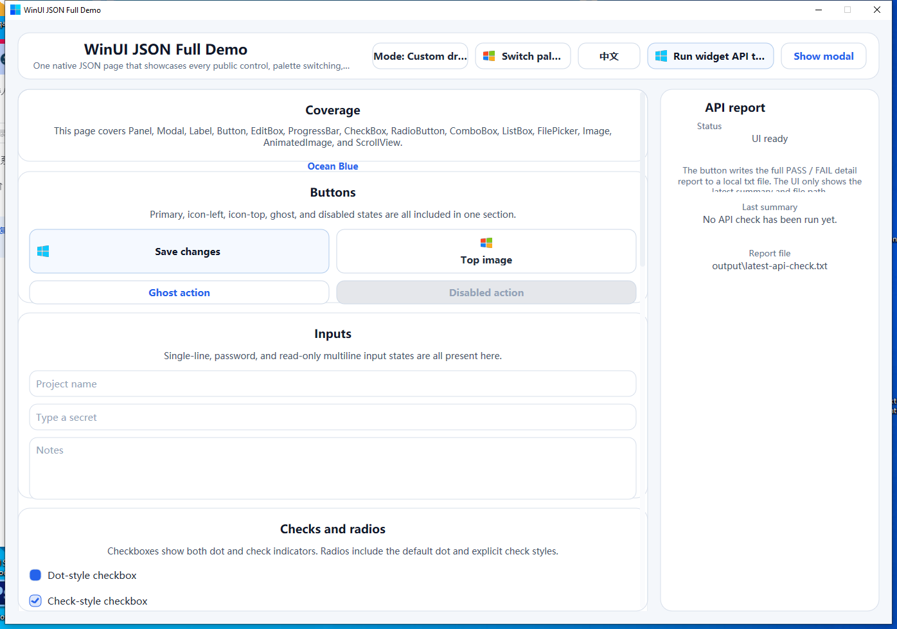
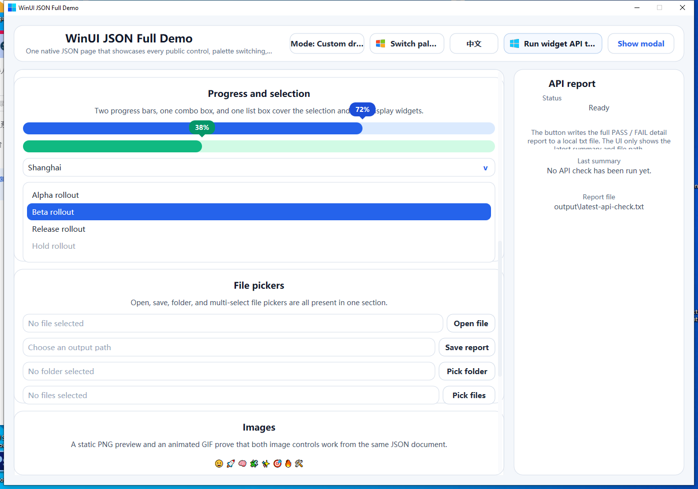
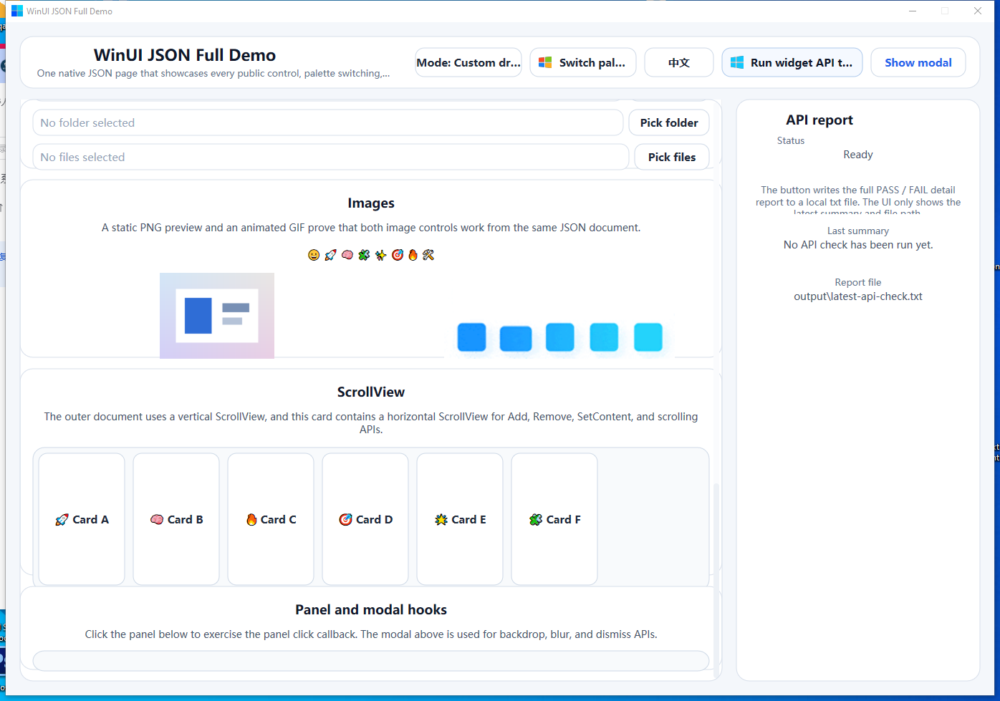

# winui

`winui` 是一个直接建立在 Win32 之上的 Windows-only Go UI 工具包。

它面向需要精确控制窗口生命周期、绘制、DPI、输入、可复用控件，以及声明式 JSON UI 层的原生桌面工具，不依赖 WebView、XAML 或跨平台包装层。

English version: [README.md](./README.md)

## 特性

- 仅支持 Windows
- 清晰的 `core` / `widgets` / `sysapi` 分层
- `RenderModeAuto`：优先 Direct2D，回退到 GDI
- 启用 `cgo` 时，Direct2D 文本渲染可以保留 Windows 彩色字体，例如 emoji
- 窗口和按钮图像资源支持 PNG / JPG / JPEG / GIF（GIF 只使用首帧）；窗口图像内部仍会转换为原生 `HICON`
- 保留式 widget 场景树，支持主题和布局
- 可复用的内置控件
- `sysapi` 中的原生打开 / 保存 / 文件夹对话框
- `widgets/jsonui` 中的声明式 JSON UI 加载器
- 支持 DPI 感知的 JSON frame 表达式，包含 `+`、`-`、`*`、`/`、`()`、`%` 以及窗口/父容器尺寸变量
- 通过 `jsonui.DataSource` 提供状态驱动绑定
- JSON 文本输入支持 `readOnly`、`multiline`、换行和滚动标志
- 声明式多行 `label`，支持宽度约束下的自动高度测量
- 声明式 `modal` / 背景遮罩，支持 Direct2D 专用的模糊遮罩
- 声明式 `scrollview`，用于 JSON 编写的嵌套滚动区域
- 运行时查找辅助，例如 `Window.FindWidget`、`Document.FindWidget` 和 `widgets.FindByID`
- 单窗口和多窗口辅助
- Demo 应用位于 `demo/demo_json_full` 和 `demo/demo_go_full`

## 包

- `core/`：窗口生命周期、绘制、DPI、输入、定时器、图像、图标、字体
- `sysapi/`：Windows 系统 API 辅助，包括原生文件对话框
- `widgets/`：场景树、事件路由、主题、布局、控件
- `widgets/jsonui/`：JSON schema 加载器、绑定、表达式、多窗口辅助
- `demo/demo_json_full/`：全功能 JSON UI demo，包含配色切换和 API 检查
- `demo/demo_go_full/`：全功能 Go UI demo，包含配色切换、模式切换和 API 检查

## 快速开始

命令式 widgets：

```go
package main

import (
	"github.com/AzureIvory/winui/core"
	"github.com/AzureIvory/winui/widgets"
)

func main() {
	opts := core.Options{
		ClassName:      "ExampleApp",
		Title:          "winui example",
		Width:          800,
		Height:         600,
		Style:          core.DefaultWindowStyle,
		ExStyle:        core.DefaultWindowExStyle,
		Cursor:         core.CursorArrow,
		Background:     core.RGB(255, 255, 255),
		DoubleBuffered: true,
		RenderMode:     core.RenderModeAuto,
	}

	widgets.BindScene(&opts, widgets.SceneHooks{
		OnCreate: func(_ *core.App, scene *widgets.Scene) error {
			label := widgets.NewLabel("title", "Hello winui")
			label.SetBounds(widgets.Rect{X: 24, Y: 24, W: 240, H: 32})
			scene.Root().Add(label)
			return nil
		},
	})

	app, err := core.NewApp(opts)
	if err != nil {
		panic(err)
	}
	if err := app.Init(); err != nil {
		panic(err)
	}
	app.Run()
}
```

JSON UI：

```go
store := jsonui.NewStore(map[string]any{
	"page": map[string]any{
		"title": "JSON Demo",
	},
})

win, err := jsonui.LoadFileIntoScene(scene, "demo.ui.json", jsonui.LoadOptions{
	Data: store,
})
if err != nil {
	panic(err)
}

title := win.FindWidget("title")
_ = title

store.Set("page.title", "Updated Title")
```

```json
{
  "wins": [
    {
      "id": "main",
      "title": { "bind": "page.title", "default": "Fallback" },
      "w": 980,
      "h": 720,
      "root": {
        "type": "panel",
        "layout": "abs",
        "children": [
          {
            "type": "label",
            "id": "title",
            "text": { "bind": "page.title" },
            "frame": { "x": 20, "y": 20, "w": 320, "h": 28 }
          }
        ]
      }
    }
  ]
}
```

## JSON UI 模型

- 顶层 `wins` 声明一个或多个窗口
- JSON 声明 widget 树、样式、动作和绑定
- 所有数据变更都由宿主代码通过 `jsonui.DataSource` 负责
- frame 值默认是逻辑 DP，并随 DPI 缩放
- 每个已声明窗口内的 widget id 必须唯一
- 省略布尔字段或绑定值缺失时，字段回退到 widget 语义：`visible` / `enabled` 保持 `true`，`checked`、`multiple` 和 `autoplay` 保持 `false`
- `input` / `textarea` 支持 `readOnly`、`multiline`、`wordWrap`、`acceptReturn`、`verticalScroll` 和 `horizontalScroll`
- `window.image`、`button.image` 和 `image` 控件接受静态 PNG / JPG / JPEG / GIF 输入；GIF 只使用首帧
- `LoadOptions.ImageSizeDP`、按窗口的 `imageSizeDP`、按节点的 `imageSizeDP` 和 `style.imageSize` 用于控制图像槽大小
- 图像渲染保留原始宽高比，并采用 contain 语义缩放，而不是拉伸成正方形
- 图像按目标像素尺寸和质量缓存；优先使用 Direct2D bitmap，必要时回退到 GDI
- 需要播放动图时使用 `animimg`
- 加载器不保证 BMP、SVG、WEBP、AVIF 或仅针对 ico 的加载语义
- `label` 支持 `multiline` 和 `wordWrap`，在宽度受限时可自动测量高度
- `modal` 支持 `backdrop.color`、`backdrop.opacity`、`backdrop.blur`、`backdrop.dismissOnClick` 和 `onDismiss`
- `frame` 支持 `x`、`y`、`r`、`b`、`w`、`h`
- 表达式支持整数运算 `+`、`-`、`*`、`/` 和括号
- 变量仅限 `winW`、`winH`、`parentW`、`parentH`
- 像 `"50%"` 这样的百分比字面量会保留传统的按轴窗口百分比语义
- 例如：
  - `100`
  - `"50%+12"`
  - `"(parentW - 12*3 - 20*2 - 108) / 4"`
  - `"(parentW-184)/4"`

## 文件对话框

Go API：

```go
result, err := sysapi.ShowFileDialog(app, sysapi.Options{
	Mode:        sysapi.DialogOpen,
	Title:       "Open a file",
	Filters:     []sysapi.FileFilter{{Name: "Text Files", Pattern: "*.txt;*.md"}},
	MultiSelect: true,
})
if err != nil {
	panic(err)
}
_ = result.Paths
```

JSON UI：

```json
{
  "type": "file",
  "id": "openFile",
  "dialog": "open",
  "buttonText": "Open...",
  "dialogTitle": "Open a source file",
  "accept": ["*.txt", "*.md", "*.go"]
}
```

## 多窗口

`jsonui.Document` 会保存每个已声明的窗口。

- `doc.PrimaryWindow()` 返回第一个窗口
- `doc.Window("tools")` 按 id 查找
- `win.FindWidget("status")` 在单个窗口内查找 widget
- `doc.FindWidget("main", "status")` 跨窗口查找
- `ActionContext.Window` 在动作处理器中指向运行时窗口
- `doc.NewApps(baseOpts)` 为每个窗口创建一个 `core.App`
- `jsonui.MountWindow(scene, win)` 创建 `WindowHost`，用于挂载 / 替换 / 拆卸的热重载流程
- `jsonui.RunApps(...)` 启动所有托管窗口并等待所有循环退出

## 运行 Demo

```powershell
go run ./demo/demo_json_full
go run ./demo/demo_go_full
```

## Demo 截图

JSON full demo 的 UI 截图：





## 验证

```powershell
go test ./...
go test -v ./demo/demo_json_full
go test -v ./demo/demo_go_full
go vet ./...
go run ./demo/demo_json_full
go run ./demo/demo_go_full
```

GitHub Actions 会在 Windows 上镜像这条验证路径，使用 `gofmt`、单独的 `go test -v ./demo/demo_json_full` 和 `go test -v ./demo/demo_go_full` 回归步骤、上传 `demo/demo_json_full/output/latest-api-check.txt`，并在 `CGO_ENABLED=0` 和 `CGO_ENABLED=1` 下运行 `go test ./...` 与 `go vet ./...`。

## 文档

- [README.md](./README.md)：英文版入口
- [DEVELOPING.md](./DEVELOPING.md)：维护规则、架构边界、验证方式
- [WIDGETS.zh-CN.md](./WIDGETS.zh-CN.md)：控件和 JSON UI 概览
- [JSONUI.zh-CN.md](./JSONUI.zh-CN.md)：JSON DSL 的中文使用指南
- [AGENTS.md](./AGENTS.md)：仓库简明指南
- [AI_CHANGELOG.md](./AI_CHANGELOG.md)：会影响后续编辑的行为变更

## 原生模式说明

`Button`、`EditBox`、`CheckBox`、`RadioButton`、`ComboBox` 和 `FilePicker` 可通过 `mode` 参数在自绘和原生系统后端之间切换。

如果希望 `ModeNative` 控件渲染出 Win10/Win11 的视觉样式，最终可执行文件仍需要 `Microsoft.Windows.Common-Controls` v6 manifest。
